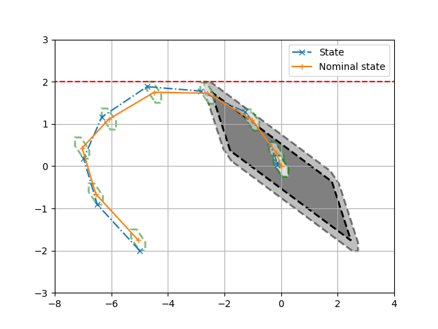

# Examples of implemented MPCs

Our packet includes the novel Remote Tube Tracking MPC approach, but also implementations of several other MPC algorithms, which our approach builds up on.
Here, we have several scripts that show how one can use these different MPC algorithms with our code.

For example, the script [Example_of_Tube_Regulator_MPC.py](./Example_of_Tube_Regulator_MPC.py) reproduces Figure 2 of [D.Q. Mayne, M.M. Seron, S.V. Raković, "Robust model predictive control of constrained linear systems with bounded disturbances," 2005](https://www.sciencedirect.com/science/article/abs/pii/S0005109804002870) as shown below.

 