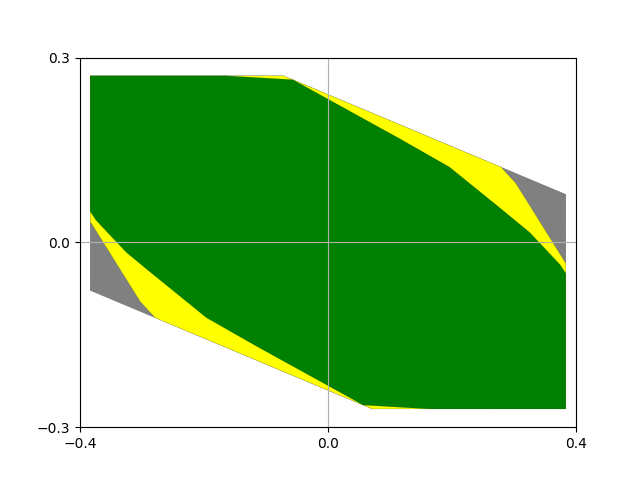

# Examples of Set Operation

Our packet does not only include the novel Remote Tube Tracking MPC approach, but also implementations of several set operations for the `polytope` package, which are the Minkowki sum, Pontryagin set difference, and the scaling of a polytope.
Furthermore, we have implemented three different ways to approximate the minimum robust positively invariant set, which have been developed by [Rakovic et al.](https://ieeexplore.ieee.org/document/1406138), [Darup and Teichrib](https://ieeexplore.ieee.org/document/8796265), and [Trodden](https://ieeexplore.ieee.org/document/7431977).
Moreover, we implemented a method to calculate the maximum output admissible set according to [Gilbert and Tan](https://ieeexplore.ieee.org/document/83532).

This folder contains several scripts that reproduce Figures from the papers that either proposed or used the algorithms to demonstrate how they function and one can use them.
For example, the script [Example of Approximation of mRPI_Darup.py](./Example%20of%20Approximation%20of%20mRPI_Darup.py) reproduces Figure 3 of [M. S. Darup and D. Teichrib, "Efficient computation of RPI sets for tube-based robust MPC," 2019](https://ieeexplore.ieee.org/document/8796265) as shown below.

 