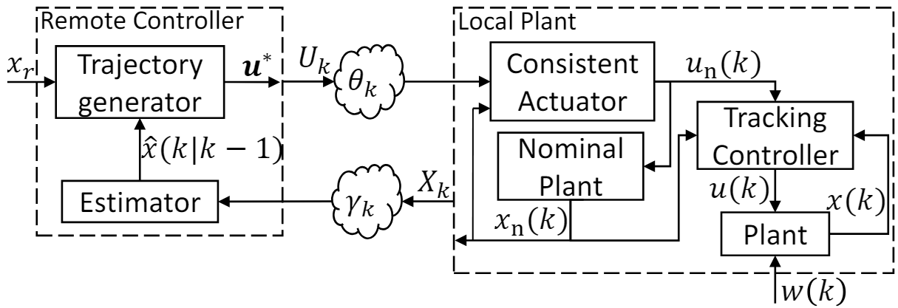

# Files to reproduce the results in the submitted paper

## Overview 
In this folder, we find the files that reproduce the figures of the paper _Remote Tube-based MPC for Tracking Over Lossy Networks_ presented at the 2024 IEEE 63rd Conference on Decision and Control.
The folder consist of four scripts and a module `Cartpole`, which implements the cartpole simulator in PyBullet. 
We compare the [Remote MPC of Pezzutto et al.](https://ieeexplore.ieee.org/document/9452064) with our Remote Tube MPC and the extended Remote Tube MPC in our paper and in the plots and animations the scripts in this folder creates.

Below you can see the architecture of our proposed remote tube MPC algorithm (Figure 2 in our paper):

 

## Decription of the files
The script [results_linear_system_with_extendedMPC.py](./results_linear_system_with_extendedMPC.py) simulates the control of the linearized cartpole model over a lossy network, where we analyze different constant packet loss probabilities for the network. This script reproduces Figure 3a and will plot a histogram similar to Figure 3d of our paper. 
Note that the histogram might be slightly different, since the computational times depend on the machine used to execute the script.

The script [results_nonlinear_system_with_extendedMPC.py](./results_nonlinear_system_with_extendedMPC.py) simulates the control of the nonlinear cartpole model over a lossy network, where we analyze different constant packet loss probabilities for the network.
This script reproduces Figure 3b and Figure 3c of our paper.
Note that while for the linear dynamics the plant state is guaranteed to be in a tube around the nominal state, this is not necessarily guaranteed for the nonlinear plant dynamics. This is especially the case if the disturbance set does not capture all potential modelling errors.

Furthermore, the scripts [results_linear_system.py](./results_linear_system.py) and [results_nonlinear_system.py](./results_nonlinear_system.py) produce similar figures as the ones presented in Figure 3, but without the extended MPC approach mentioned in Section IV.F.

Below you can see the reproduction of Figures 3b and 3c, where the Remote MPC, our Remote Tube MPC, and our Extended Remote Tube MPC are labelled, R-MPC, RT-MPC, and ERT-MPC, respectively.

 

The script [estimate_W_for_Cartpole.py](./estimate_W_for_Cartpole.py) estimates the disturbance set $\mathbb{W}$ as described in Section V.A of our paper. 

Finally, the script [create_animations.py](./create_animations.py) creates animations of the inverted pendulum when it is controlled over a lossy network with the [Remote MPC of Pezzutto et al.](https://ieeexplore.ieee.org/document/9452064) and with our two proposed Remote Tube MPC approaches.
Below we show the animation of trajectories of the Remote MPC (left), our Remote Tube MPC (middle), and the extended Remote Tube MPC (right) when there are 40% of packet drops in the network.

  

> :exclamation: To solve the optimization problem in the different MPC algorithms, we use the `CVXPY` package with the CLARABEL solver. 
However, we have encountered that the CLARABEL solver fails sometimes. 
Therefore, when one runs the scripts it could happen that the execution of the solver fails. 
We have not yet determined the reason for the failure, but when one re-runs the script after failure it often works.